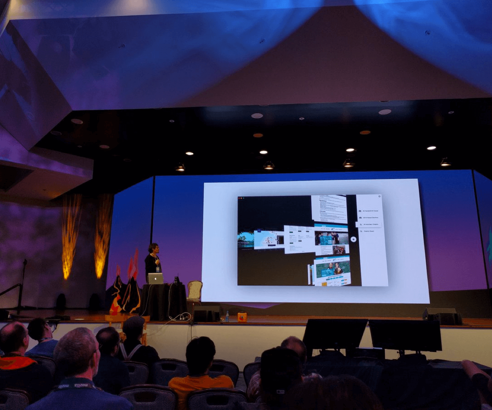

# Browser.html

At a time when Mozilla had bold ambitions small team was formed reimagining new generation web browser to complement a new generation web engine. It seemed obvious that new web engine had to be used to build it's own interface. This lead to the highlight of my carreer filled with challenges & rabbit-holes. Turns out innovative and performant user interfaces built with "work in progress" (and an established) web engines is hard but also very fun.

