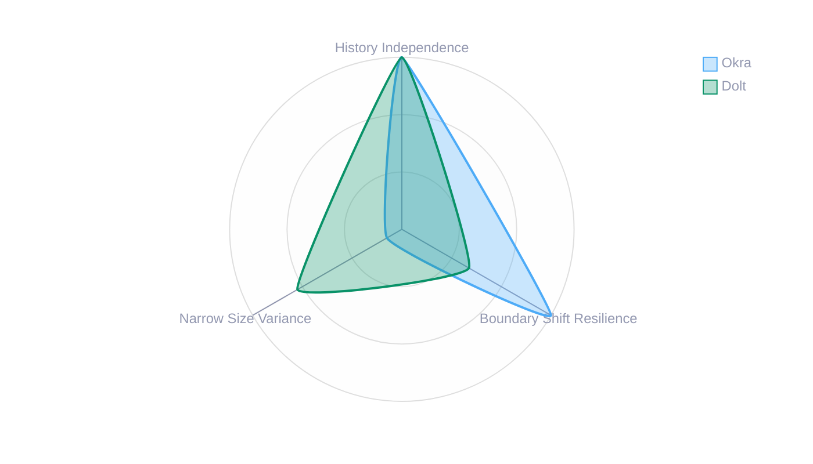
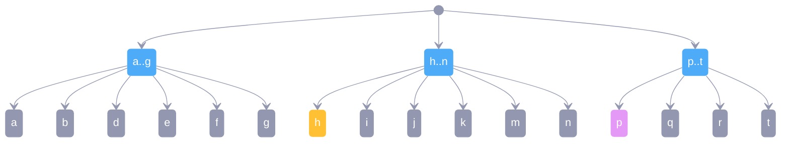
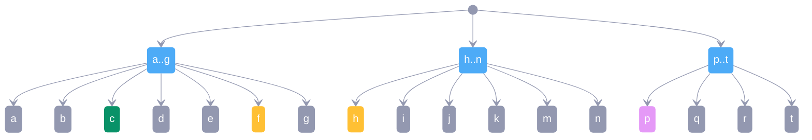
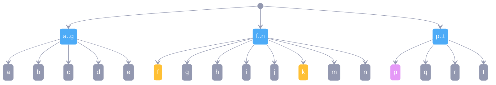
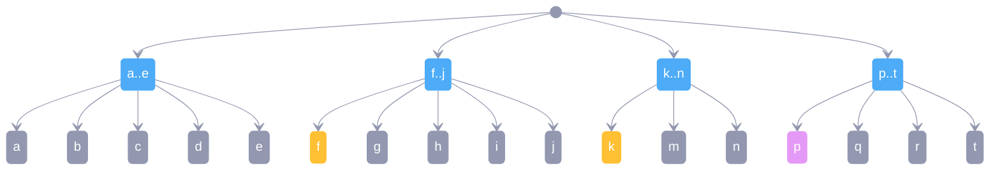
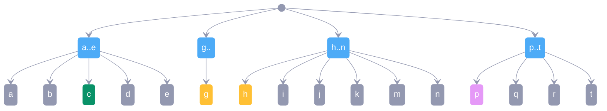
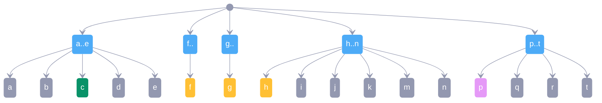
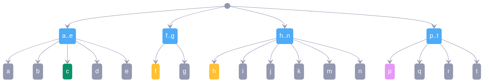
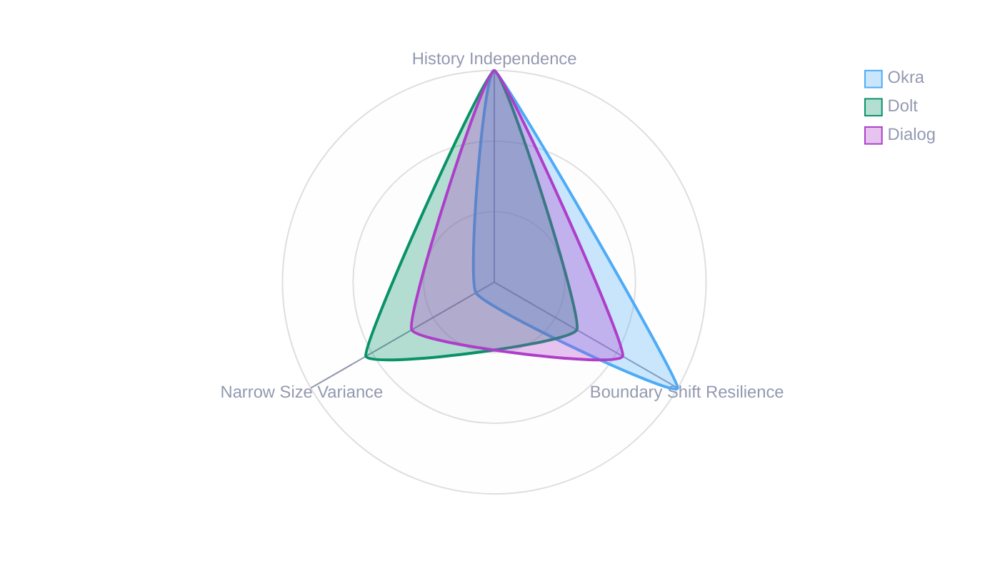

#  Improving Size Variance

Dialog DB is designed with [local-first][] principles, aiming to operate without traditional servers by building on content-addressed storage. Like Git, local replicas can cooperate through remote content-addressed stores. To achieve efficient replication in such settings, dialog uses search tree algorithm that is [history independent][] and resilient to [boundary shifts][]. Narrowing [size variance][] is currently under exploration and subject of this article.

## A Brief Primer on Search Trees

### [B-Tree][]

> In [computer science](https://en.wikipedia.org/wiki/Computer_science), a **B-tree** is a self-balancing [tree data structure](https://en.wikipedia.org/wiki/Tree_data_structure) that maintains sorted data and allows searches, sequential access, insertions, and deletions in [logarithmic time](https://en.wikipedia.org/wiki/Logarithmic_time). 

As so many good things were invented in 70s and is a classic data structure for databases. 

They are not [history-independent][] though as the tree layout depends significantly on the insertion order. Typical implementations perform rebalancing which also causes  [boundary shifts][]. This makes them impractical for Dialog DB.

### Merkle Search Trees (MST)

> *A. Auvolat, F. Taïani. (2019) “*[Merkle Search Trees: Efficient State-Based CRDTs in Open Networks](https://hal.inria.fr/hal-02303490/document)*“*

To my knowledge first known algorithm  defining a B-tree that is [history-independent][] and resilient to [boundary shifts][]. Ideas is elegant - hash entries and place them in a tree at a level proportional to the number of 0’s in the prefix of their hash. I do however find  insertion / removal algorithm a lot more complicated than algorithms that follow. 

Notably they MST has being [incorporated into @ATProtocol spec](https://atproto.com/specs/repository#repo-data-structure-v3)

### Probabilistic B-Tree

#### Prolly Tree

Originally introduced in [Noms](https://github.com/attic-labs/noms/blob/master/doc/intro.md#prolly-trees-probabilistic-b-trees) and invented by [Aaron Boodman](https://aaronboodman.com/). Original idea was to apply content-defined chunking (CDC) via [rolling hash function](https://en.wikipedia.org/wiki/Rolling_hash) to delimit nodes into sibling groups, create nodes from those groups forming a parent layer and repeat until you have tree. Updates are also simple, add / remove leaf and perform prior logic starting from the target sibling group. Since tree layout is derived from applying CDC on leaves it is [history-independent][]. Algorithm also inherits resilience to  [boundary shifts][] from CDC.

#### Chunky Tree

I was first introduced to the novel search trees by [Mikeal Rogers](https://github.com/Gozala/mikeals-cancer-diaries/blob/832f1952b5a271e04acbf1c3a40995abc7172f2f/best-memories/one-who-cares.md) who [independently came up](https://github.com/attic-labs/noms/issues/3878) with [Chunky Tree](https://github.com/mikeal/prolly-trees) algorithm that was remarkably similar to Prolly Tree. Main difference was that entries were delimited into sibling groups by identifying **boundary nodes**, which were determined from node hash itself based on probability distribution.

> I suspect difference in idea may have stemmed from the fact that Mikeal worked on IPLD where content to store was already identified by hash.

After Mikeal discovered Prolly Trees he adopted and continued implementation under that name.

#### Okra

[Joel Gustafson](https://joelgustafson.com) recognized an interesting symmetry between [Prolly Tree][Prolly Tree] and [Skip List][] if you add anchoring backbone it, which also happens to eliminate (leftmost) [boundary shift][boundary shifts] that is possible otherwise. **Okra** is an implementation of this design and a manifestation of another insight - you can map _Prolly Tree_ to a key value store *(that usually would be B-Tree)*.

> I highly recommend [Merklizing the key/value store for fun and profit](https://docs.canvas.xyz/blog/2023-05-04-merklizing-the-key-value-store.html#key-value-stores-all-the-way-down) as the best introduction to Prolly Trees and inherent properties that make them a great synchronization primitive in distributed settings.

While idea of mapping prolly tree onto key value store is brilliant, it [comes with a tradeoffs](https://docs.canvas.xyz/blog/2023-05-04-merklizing-the-key-value-store.html#concurrency-constraints) like prevent git style branching workflows. My attempts to come up with a different mapping strategy that would address this have failed.

#### Dolt

Dolt evolved from idea of original [Prolly Tree][] optimizing it for SQL database with Git-like version control. They have identified problem with **[size variance][]** and addressed it with an elegant solution: dynamically adjust probability that node needs to be determined a **boundary node**. They also took inspiration from Mikeal's idea and [switched from rolling hashes to key hashes](https://www.dolthub.com/blog/2022-06-27-prolly-chunker/#rolling-hash-stability). 

### Geometric Search Tree (G-tree)

[G-tree](https://g-trees.github.io/g_trees/) is the newest data structure that offers similar properties, but with even simpler algorithm - Instead of delimiting nodes into siblings groups at every level of the tree you assign geometrically chosen [ranks](https://g-trees.github.io/g_trees/#rank_informal) and treat them as nodes vertical position (same ranked adjacent nodes form sibling groups making). Geometric distribution can be [simulated from entry hashes](https://textile.notion.site/Flipping-bits-and-coins-with-hashes-205770b56418498fba4fef8cb037412d).

#### Search Tree in Dialog

Dialog's search tree implementation is based on the [G-tree][] algorithm. It slightly diverges from paper by pushing entries into leaf layer and in that regard is more similar to [Okra][] in terms of layout, however it or other [prolly tree][] we don't need to detect boundaries in the upper levels of the tree by node hashes we can do it by comparing rank of leftmost leaf (of that node) to tree height is not same it is a boundary.

### Search Tree Characteristics

It appears that there are following key characteristics that impact query, update and replication performance and are in tension with each other - You can guarantee two out of three, or compromise some to a degree to make improve guarantees on third



#### History Independence

> In a history independent data structure, nothing can be learned from the memory representation of the data structure except for what is available from the abstract data structure. 

More simply if the structure of the tree is independent of insertion order it is [history independent](https://dl.acm.org/doi/10.1007/s00453-004-1140-z). This property is very important if you want to synchronize uncoordinated changes to the tree. That is because it allows finding differences between two replicas without having to explore all paths. If insertion order could load to different tree structures we would not even be able to tell if two replicas are the same requiring us to scan seemingly different subtrees. 

>  For a while I was thinking about _history Independence_ as a binary property but that seems little close minded. Better way to think about is in terms of how much drift from perfect can be tolerated - how strongly history Independent structure is. It is important to remember why we care about this property. For example It is possible to weaken the property while retaining or in some cases improve ability to identify differences efficiently by allowing bit of drift

#### Boundary Shifts

Stronger the resilience to boundary shifts the smaller the impact of a random edit. To make it more concrete it would a lot simpler that mentioned algorithms to delimit nodes into sibling groups by a fixed sizes and build tree that way this would give us perfectly [history independent][] tree and perfectly narrow [size variance][] but absolutely terrible resilience to boundary shifts because inserting an entry would update everything on the left of it. On the other hand [Okra][] has perfect [history independence][] a high resilient to [boundary shifts][] allowing to make very little changes

> Making a random change in our key/value store with 16 million entries only requires changing a little less than 7 merkle tree nodes on average.

It's probably obvious why high resilience is relevant generally, but it is even more important in distributed settings where shifts would lead to redundant network roundtrips and cache invalidations.

#### Size Variance

I'm deliberately vague about what size means it could be [branching factor](https://en.wikipedia.org/wiki/Branching_factor) which corresponds to the size of sibling groups or it could be byte size of the serialized node, often there is a high correspondence between the two. High variance in size makes performance characteristics unpredictable as some nodes may end up huge and others tiny. 

All the mentioned search tree algorithms other than [B-Tree][] compromise to various degrees on this property in order to gain first two. In theory because boundaries are detected from cryptographic hashes based on probability it is expected to get a balanced distribution, in practice there are no guarantees and results can vary.

> In Dialog while nodes tend to be **on average** of desired density (child count), variance is high and median is far apart from the average. This is something we would like to address by recalibrating tradeoffs.

### Calibrating Tradeoffs

#### Strengthening Size Variance

Authors of Dolt came up with a clever yet simple solution - Correlate probability with size.

> I'm going to describe idea conceptually to build an intuition, for accurate description see [Dolt's article](https://www.dolthub.com/blog/2022-06-27-prolly-chunker/)

Let's say we want to divide nodes into sibling groups lead by a **boundary** node. We determined that probabilistically to get on **average**  `Q` sized groups boundary node needs to have hash that starts with `n` number of `0`. Instead of keeping `n` static we can choose to decrease it as our group nears desired size e.g. once we have `Q/2` siblings in the group we can decrement `n` which would improve probability of finding a boundary because now we need less `0` to occur. 

Now we if we find boundary before reaching pressure zone we have a strong / permanent boundary. If we find it in the pressure zone we had to compromise a little no our requirements so we end up with **weak**er boundary. 

> We just have two zones to for simplicity, but imagine many zones instead each with weaker requirements (less `0`s) producing weaker boundary.

#### Weakening Boundary Shift Resistance

Strengthening [size variance][] requires weakening resilience to [boundary shifts][]. To illustrate, let's assume we have a tree where we have one weak boundary and one permanent boundary.

> Yellow nodes are weak boundaries, and purple are permanent boundaries



Consider scenario where new `c` node is inserted into a search tree. It will cause us to reassess sibling group for boundaries and since group was past `Q/2` weakened requirements caused `f` to become a boundary. 



As a result we have to shift nodes starting with new boundary `f` into a next group. This in turn places `h` into stronger requirements zone so weak boundary status no longer holds. But now `k` is in the zone with a weaker requirements that it clears and gains boundary status, causing another split.



This time however if we shift nodes from new boundary `k` into next group we'd still end up breaking that group at `p` because it is a permanent boundary _(it did not depend on weakened requirements)_ preventing shifts from cascading further in the tree.



Insight here is that weak boundaries depend on extra context like group size to clear the selection requirements, but when context changes they may no longer clear requirements and therefor fail to prevent cascading shifts. Sometimes shifted nodes can be absorbed by the next group and also stop cascading shifts.

Hopefully this demonstrates how improving [size variance][] weakens resilience to [boundary shifts][].

#### Weakening History Independence

We could also strengthen [size variance][] but instead of resilience to [boundary shifts][] we could have weakened [history independence][]. To illustrate this lets start with a same tree as last time except before we had  `f` was inserted


````mermaid
---
config:
  theme: 'base'
  themeVariables:
    primaryColor: '#9398B0'
    primaryTextColor: '#fff'
    primaryBorderColor: '#9398B0'
    secondaryBorderColor: '#9398B0'
    lineColor: '#9398B0'
    secondaryColor: '#000000'
    secondaryTextColor: '#000000'
    tertiaryColor: '#fff'
---
stateDiagram
		classDef weak fill:#FFC034,stroke-width:0;
		classDef strong fill:#E599F7,stroke-width:0;
		classDef index fill:#4DABF7,stroke-width:0;
		classDef new fill:#099268,stroke-width:0;
		classDef delete fill:#4DABF7,stroke-width:0,opacity: 0.3, border:0;

    a_: a..g
    h_: h..n
    p_: p..t
    
    [*] --> a_:::index
    [*] --> h_:::index
    [*] --> p_:::index

    a_ --> a
    a_ --> b
    a_ --> d
    a_ --> e
    a_ --> g
    
    h_ --> h:::weak
    h_ --> i
    h_ --> j
    h_ --> k
    h_ --> m
    h_ --> n
    
    p_ --> p:::strong
    p_ --> q
    p_ --> r
    p_ --> t
    
````

Now if we still insert `c` before we insert `f` we will end up with `g` becoming a weak boundary instead. However instead of shifting we will create it's own group.



Now if we insert `f` we'll end up with pressure to split again and with another sibling group



If have switched insertion order and did `f` then `c` we would have with a different tree instead 




> I do not know which one dolt compromises here, but it must be one or the other, because insertion may split a sibling group at which point split out segment either joins the next group causing potentially cascading [boundary shifts][] or stay independent compromising [history independence][].

It is worth observing that probability distribution adds some resilience to boundary shifts although I don't believe it can't be guaranteed. Same could be said about weakened [history independence][] it gets slightly compromised but over time it in normal circumstances it should chart towards convergence as opposed to divergence although it seems possible to simulate contrary scenario.

#### Considerations

##### Network vs Disk IO

Traditional databases optimize for disk I/O, Dialog DB optimizes for network IO where latency dominates. This fundamental difference has profound implications for tree design:

**Disk I/O characteristics:**

- Sequential reads are fast
- Random access has high latency
- Optimal node sizes align with disk blocks
- Deep trees are acceptable if they minimize seeks

**Network I/O characteristics:**

- Each round trip adds significant latency
- Bandwidth is less of a constraint than latency
- Tree depth directly impacts response time

For Dialog DB, this means:

- **Shallow trees are critical**: Each level requires a network round trip. Reducing depth from 4 to 3 levels can improve response times significantly
- **Larger nodes can be beneficial**: A single 64KB fetch might be faster than four 16KB fetches due to round-trip overhead
- **Stable boundaries enable caching**: When boundaries shift, cached paths become invalid, triggering additional network requests
- **Partial replication benefits from locality**: Natural data boundaries improve the efficiency of on-demand fetching

These constraints suggest that tolerating some size variance to maintain stable, meaningful boundaries may be a better tradeoff than Dolt's tight size control.

> Dolt's approach represents a pragmatic solution for SQL databases where predictable performance characteristics are crucial. By using a cumulative distribution function (CDF) to dynamically adjust split probability based on current chunk size, they achieve a normal distribution around their target size. This provides excellent variance reduction - essential for consistent query performance in a database context.

#### Leveraging Natural Data Boundaries

For Dialog DB, we're exploring approach inspired by Dolt's, however we'd prefer bit more resilience in boundary shifts at the cost of less narrow variance in size.



Instead of forming boundaries with size-based heuristics we are considering to leverage the natural structure in our data to identify boundaries more resilient to shifts. Before we dive into details, we need to cover look get som details of how we represent data in search tree

##### Dialog Search Tree Key Layout

Keys in Dialog's search tree are comprised of following components:

- Index Identifier
- Entity Identifier 
- Attribute Namespace
- Attribute Name
- Value Type
- Value

All keys are prefixed by index identifier component which determines order of the remaining components. 

###### Entity Attribute Value (EAV) Index

Index provides efficient access to the *attributes by entity*. It is similar to primary key lookup in relational databases.

```
/EAV/Entity/Namespace/Name/Type/Value
```

###### Attribute Entity Value (AEV) Index

Index provides efficient column-style access for retrieving *entities by attribute*.

```
/AEV/Namespace/Name/Entity/Type/Value
```

###### Attribute Entity Value (AEV) Index

 Is used for reverse lookups like navigating relations backwards. 

```
/VAE/Type/Value/Namespace/Name/Entity
```

> Given EAV, you can find what the speed of the Pikachu is 
>
> ```ts
> db.select({ the: "pokemon/stat/speed", of: pikachu })
> ```
>
> And with AEV you can also efficiently find all the other Pokémon that have same speed. 
>
> ```ts
> db.select({ the: "pokemon/stat/speed", is: speed })
> ```

##### Identifying Natural Data Boundaries

The key insight is that _natural boundaries exist in the data_ and given all nodes are sorted by keys when we need to enforce boundaries because large spans of siblings rank same we can choose to split at most natural boundary in the keys space to make it more resilient to shifts.

```
EAV   ba4...b46q   pokemon name          string     delibird
EAV   ba4...b46q   pokemon stat/speed    uint       55
EAV   ba4...b46q   pokemon stat/attack   uint       55
EAV   ba4...b46q   pokemon type          string     ice/flying
EAV   ba4...amkh   pokemon name          string     volcanion
EAV   ba4...amkh   pokemon stat/speed    uint       70
EAV   ba4...dbiq   todo    title         string     shopping list
EAV   ba4...dbiq   todo    completed     bool       false
AEV   pokemon      name    ba4...b46q    string     delibird
AEV   pokemon      name    ba4...amkh    string     volcanion
```

Except above shows that splitting at index boundary (EAV vs AEV) would be ideal choice, but if not available splitting by namespace boundaries (pokemon vs todo) would be our next best choice as such splits would provide superior locality for reads and writes. These boundaries are:

1. **Semantically meaningful**: Queries often access data within the same index, namespace
2. **Naturally stable**: New pokemon data won't shift the todo boundary
3. **Cache-friendly**: Related data stays together

Our algorithm distinguishes between:

1. **Strict delimiters** - Boundaries determined by geometric distribution from content hashes
2. **Forced delimiters** - Applied only when nodes reach max capacity, chosen at natural data boundaries

When forced splits are necessary, we **force boundary at node that has most semantically different key from their sibling**. This approach provides:

**Cascade resistance**: Natural data boundaries persist even as data grows. Adding more Pokémon data doesn't affect where the todo boundary occurs.

**Query locality**: Range queries like "all pokemon stats" naturally stay within the same nodes, improving cache efficiency and reducing network requests.

**Write locality**: Batch updates to a namespace are more likely to affect a single node, reducing write amplification.

**Network optimization**: By allowing larger variance in node sizes (e.g. up to 3x of optimal size), we maintain shallower trees while ensuring splits happen at meaningful boundaries.

The fundamental tradeoff compared to Dolt:

- **Dolt**: Size uniformity > Boundary stability (optimized for consistent disk I/O)
- **Dialog**: Boundary stability > Size uniformity (optimized for network caching and locality)

##### Implementation Approach

The algorithm modifies tree construction to leverage data boundaries:

1. Process nodes normally, respecting natural content-defined boundaries
2. If a node exceeds capacity:
   - Identify natural boundary (index/namespace/name changes)
   - Weight candidates by boundary significance and position
   - Split at the highest-scoring natural boundary
3. Continue processing with semantically coherent segments

This maintains content-defined chunking for most boundaries while ensuring forced splits align with data access patterns.

##### Why This Matters

For a passive database with on-demand partial replication:

- **Stable boundaries** reduce cache invalidation
- **Semantic boundaries** improve prefetch efficiency
- **Larger node tolerance** reduces tree depth
- **Natural locality** minimizes network requests for related data

The occasional large node at a namespace boundary is preferable to frequent boundary shifts that scatter related data across multiple network requests.


[history independent]:#History_Independence
[history independence]:#History_Independence
[boundary shifts]:#Understanding_Boundary_Shifts
[B-Tree]:https://en.wikipedia.org/wiki/B-tree
[local-first]: https://www.inkandswitch.com/essay/local-first/
[Prolly Tree]: #Probabilistic_B-Tree_a_k_a_Prolly_Tree
[Skip List]: https://en.wikipedia.org/wiki/Skip_list
[Okra]:#Okra
[size variance]:#size_variance