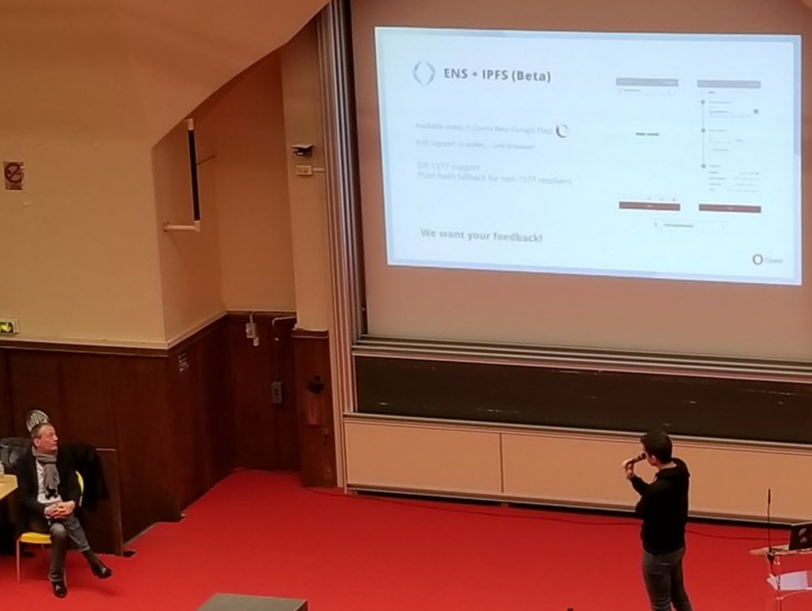

# IPFS protocol support in Firefox

[I have collaborated with IPFS][ipfs-collaboration] team on integrating [libdweb][] into [IPFS Companion][] add-on. This made it possible to run a full fledged IPFS node in the Firefox extension context adding `ipfs://` protocol support to Firefox.

This work had being noticed by the [Brave browser][] and soon after they successfully collaboration with IPFS team and brought [libdweb][] inspired APIs to Brave extensions and subsequently IPFS protocol support. _(Image below shows  IPFS protocol support in brave)_.

[Opera web browser][] also since announced their plans to [add support for IPFS protocol][ipfs-opera].

[ipfs-collaboration]:https://blog.ipfs.io/2019-10-08-ipfs-browsers-update/#firefox
[libdweb]:https://github.com/mozilla/libdweb "Experimental web-extension APIs for implementing P2P systems"
[IPFS Companion]:https://addons.mozilla.org/en-US/firefox/addon/ipfs-companion/
[Brave browser]:https://brave.com/
[Opera web browser]:https://www.opera.com/
[ipfs opera]:https://blog.ipfs.io/2019-10-08-ipfs-browsers-update/#opera

