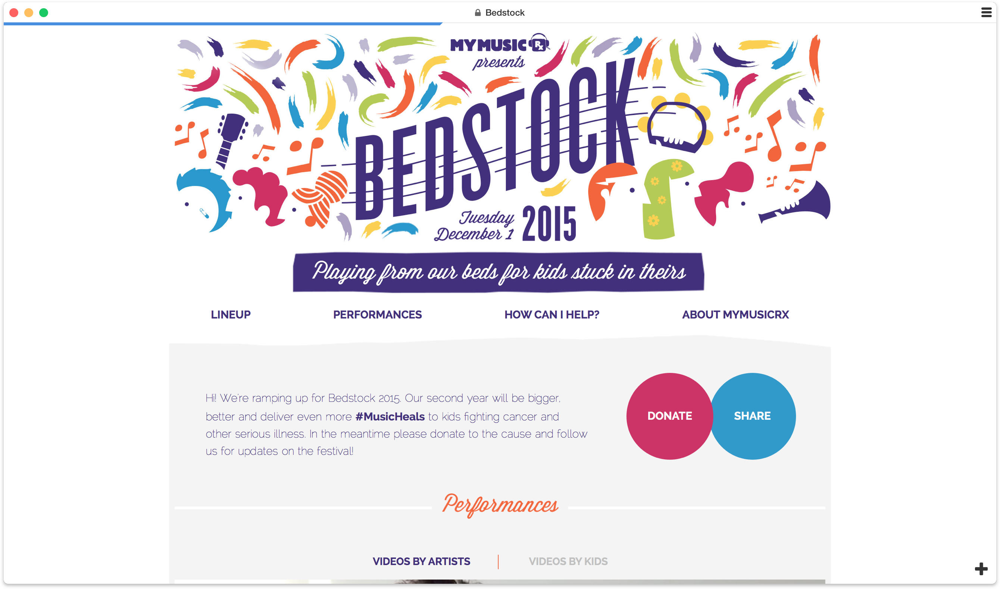
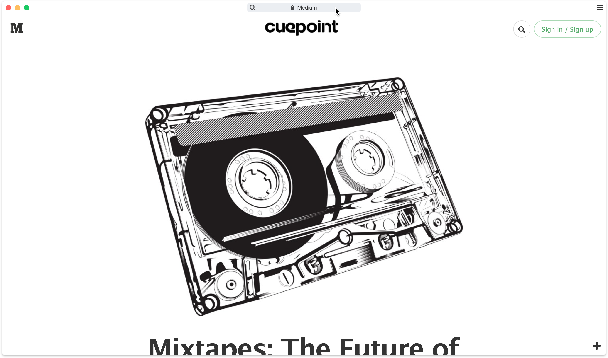
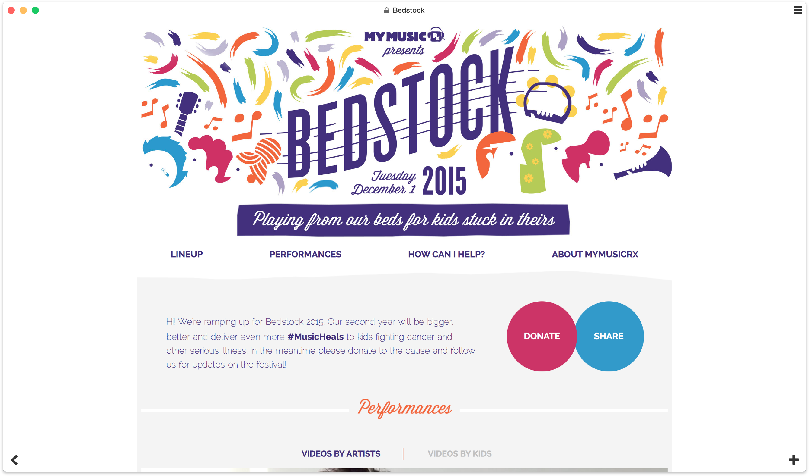
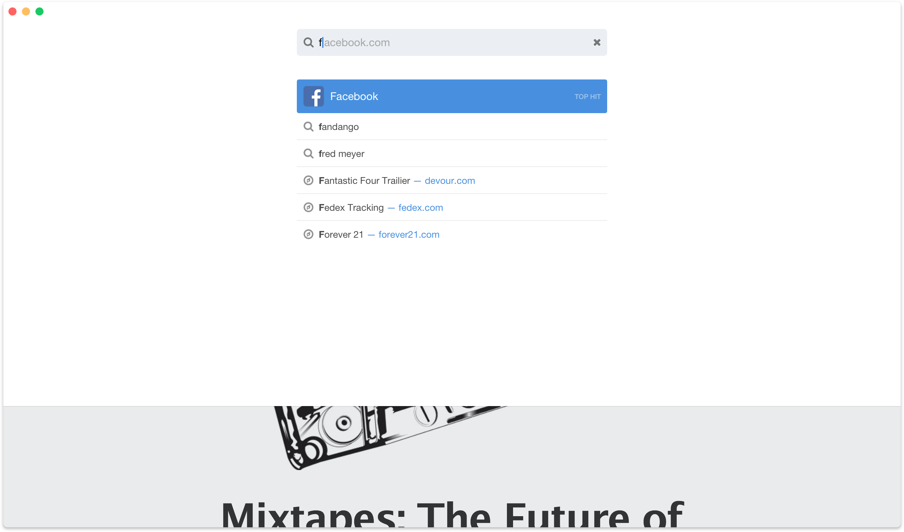
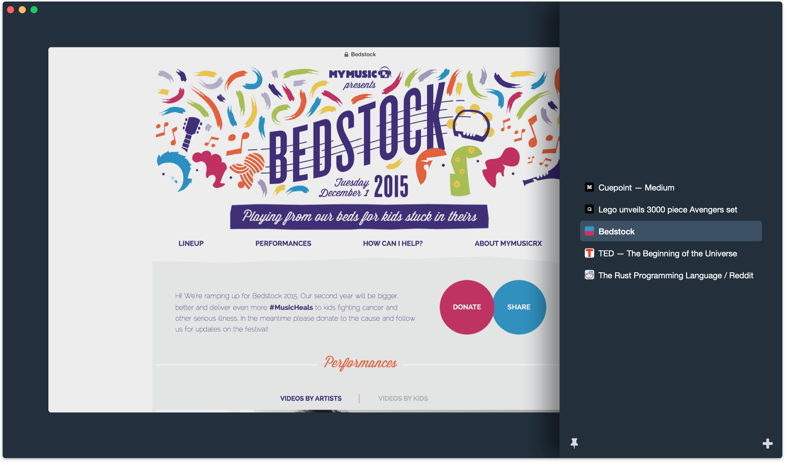
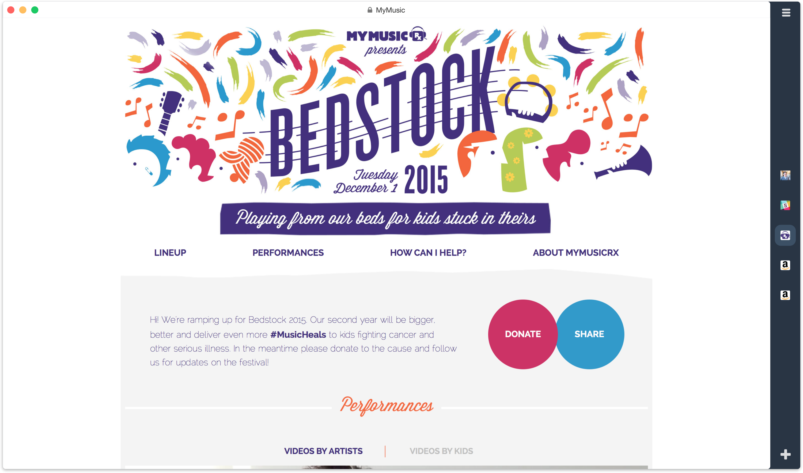

# Perspectieve UI

Introduction of [3D touch][] inspired us to explore a new dimension. We completely redesigned user interface, stepped back from [cards](./web-cards) concept to more familiar tabs model as a default UI for [servo][] nightly builds. 

In this iteration we opted into more minimal progress bar and spend a lot of time to improving load-time perception it created. Turns out same load time can be perceived as very slow or fast based on how it progresses. 

We made browser chrome some more minimal that it became indistinguishable from the content, so we made chrome fade-in  when you'd reach for it.

New tab button was added to the right bottom corner overlaying the content. And on the left bottom corner we placed a back button only if there was a page to go back to.

Clicking address bar transitions you UI to the edit mode.

Tabs were revealed on [3D touch][], when switching between tabs with `control tab` or via little hamburger menu button in the top right corner.

We also made it possible to pin tabs as a small sidebar so your tabs would always be at your fingertips.

[servo]:https://servo.org/
[3D touch]:https://developer.apple.com/design/human-interface-guidelines/ios/user-interaction/3d-touch/