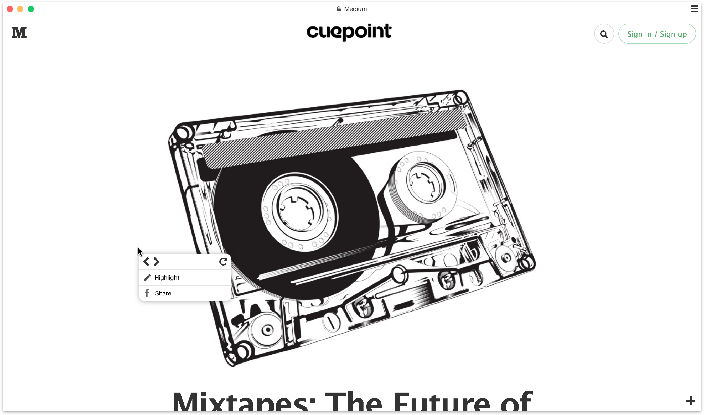

# Perspectieve UI

Servo-based browser with a user interface that is just an HTML file hosted in the cloud.

------

A website should be able to art-direct the experience. No more ugly frame around the web.

In addition to 3D touch and gestures, right-clicking the page offers additional browsing tools.

The mini location bar fades in when you hover over title. 

Clicking location bar transitions you to edit-webview mode.

Minimal progress bar

Visible back button to augment gestures and right click menu.

Reveal tabs

You can also pin the sidebar so your tabs are always at your fingertips.

In action

