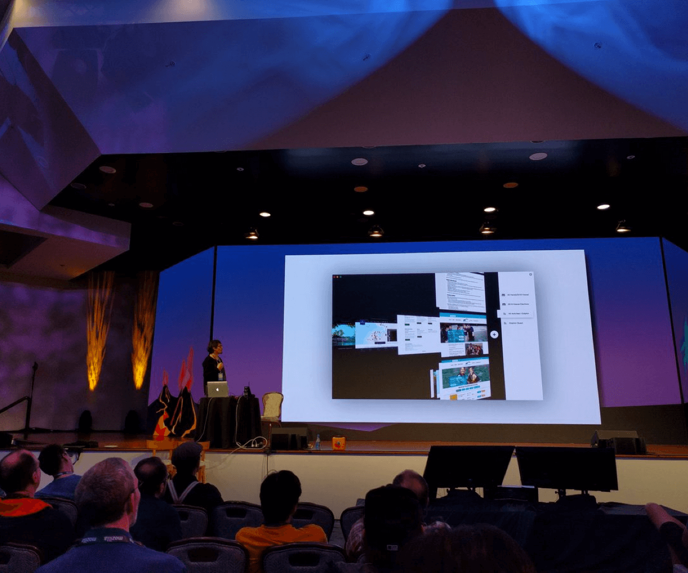

# Work Experience

## Local First

Asymmetry of traditional server/client architectures creates a power disbalance. Power is exercised by trapping users data for profit. P2P/Distributed/Decentralized technologies have a symmetric architecture (every peer is both server and client) and that leads to a different data ownership model. I devoted last years of my career at Mozilla enabling such technologies.  

#### Libdweb

Identifying gaps of the web platform and filling those in Firefox to bring those technologies was project [libdweb][]. Through collaboration with [IPFS][], [Dat][] and [SSB][] communities missing primitives were recognized, which I have implemented as an experimental Firefox extension APIs. This lead to several successes:

- [IPFS Protocol support in Firefox](./libdweb/ipfs).
- [Dat protocol support for Firefox](./libdweb/dat) (Compatible with [Beaker][] browser) and [Cliqz][]. 
- [Cliqz contept mobile browser](./libdweb/dat-mobile) with Dat protocol support.
- [WebTorrent concept browser](./libdweb/wtp)

#### Lunet

Enabling symmetric systems but within the constraints of existing web platform was goal of [Lunet][] project. It (ab)used range of web capabilities _([ServiceWorkers][], [Sandboxed iframe][sandoxed-iframe] and [Content Origin Policies][])_ to create a sandboxed web runtime in which applications work offline, operate on user data and are unable to track / silo users. 

It also opportunistically leveraged companion native application to use capabilities unavailable in web platform, proposing [progressive peer-to-peer web application (PPWA)][PPWA] architecture.

#### Content addressable data feeds

Inspired by developments of IPFS, Dat, SSB protocols I have [drafted a concept](./ipdf) of content addressable data feeds that enable collaborative applications adherence to [Zero Knowledge Architecture (ZKA)][ZKA]. [Shared this research with community][ipfs-camp-ipdf] and through continued collaboration with Textile team converged on design of new [Threads Protocol][threads_v2].

## User Interface

Reimagining medium for the web, that is not just a client application a.k.a web browser. The True User Agent had been recurring objective of small team at Mozilla that I had opportunity to be a part of.

User interface for the new generation web engine [Servo][], fit for the future and adequate for volumes of information that conventional browsers were failing to manage, was the goal of the [browser.html][] project. Empowered by [user research][] I have took part in exploring several concepts.

#### Frame free web

A **website art-directing the experience** was the future in which browser is an OS in disguise _(a.k.a [Firefox OS][])_. There was no place for ugly frame around the web, so we developed minimal chrome that like chameleon would adapt and blend in with the the content. [Read more][Frame free web]

#### Web Cards

Concept reimagined tab strip (a.k.a Needle in a Haystack) as neatly organized, filterable list of cards, each capturing essence of the page. [Read more][Web Cards]

#### Web Clips

Web clips reimagined bookmarks as **cards clipping most valuable content** from the web building it's heat map as a replacement for the long list of addresses. [Read full story][Web Clips]

#### Web Highlighter

Highlighter concept was an attempt to fill the need of **collecting and sharing content** on the web. Allowing user to capture any selection from the web page into a catalog that could be annotated and shared. [Read full story][Web Highlighter]

#### Perspective UI

Servo browser user interface as an HTML file in the cloud that you can fork to customize. In this iteration we dropped [cards concept][web cards] and pushed browser chrome into a third dimension [Read more][Perspective UI]

#### Lossless Web Navigation with Trails

Trails concept was an attempt to evolve problematic user interface concepts like tabs, navigation history, bookmarks into unified concept that visualized a user’s journey through the web. Implementation mapped active browsing sessions (tabs), corresponding histories (session history) and past sessions (browser history) to navigation trails by visualizing it through rows  as expandable stacks of cards. [Read full story](https://medium.freecodecamp.org/lossless-web-navigation-with-trails-9cd48c0abb56)

#### Spacial User Interface of the Web

We set out to enhance existing browser workflows such that they felt familiar & more effective. Special user interface with added dimension and pressure sensitive [3D touch][] were applied across all interactions and views to convey rich yet intuitive mental model. [Read full story](https://medium.com/free-code-camp/lossless-web-navigation-spatial-model-37f83438201d)

## Runtimes / Frameworks

Performant spacial user interface in 3D space using web platform was a challenge and a journey that has unfolded in parallel.

#### Starling

To take an advantage of modern hardware and parallel [servo][] engine we have designed a new concurrent runtime inspired by Erlang [Actor Model][]. Actors were represented via async functions that communicated through read/write streams and were dispatched onto the thread pool. Implementation of actors could be seamlessly switched between JS or Rust allowing greater optimization optimizations. [Read more][starling]

#### Dominion

Running complex JS UI logic in the UI thread meant dropped frame sooner or later. This inspired my work on Virtual DOM library that moved that logic to the worker thread(s). By representing Virtual DOM tree and changes to it via byte code it became possible to program UI in worker thread, transfer all updates without copying.  [Read more][dominion]

#### Decoders

Running UI logic in the worker thread(s) required mechanism for event handling. Inspired by [parser combinators][] in functional languages I came to a solution that represented event handlers _(in the worker thread)_ via declarative event serializer. They were represented as a (part of Virtual DOM) byte code, run on events to capture & transfer required details for worker thread. [Read more][decoders]

#### TomTom UI Toolkit

I have designed and implemented high performance JS framework with reactive data bindings to powering [TomTomGo Live 1000][] user interface. Hardware limitations required an aggressive and at times creative optimizations to deliver smooth experience. [Read more][tomtom-webkit-ui]

#### Narval XULRunner

Toolkit for building **cross-platform desktop apps with JS, HTML, and CSS** predating [ElectronJS][] and [NodeJS][]. Project was a port of [NarvalJS][] _(JS Server runtime predating [NodeJS][])_ to Mozilla [XULRunner][] that provided APIs for building cross-platform UI apps with HTML and native toolkits. [Read more][narwal-xulrunner]

#### Firebox

Application runtime for running [Firefox OS Apps][firefoxos-apps] across multiple desktop platforms. It was used in an initial prototypes of [browser.html][] project. [Read more][firebox]

## Other

#### TomTom Home (in the Cloud)

Project replaced [TomTom Home][tomtom-home] desktop application _(Primarily map marketplace)_ with a web application. Novel idea _(at a time prior to internet connected devices)_ entailed putting HTTP server with REST API on the device so that web application _(Cloud based marketplace)_ could use to install purchased content. [Read more][tomtom-home-cloud].

[libdweb]:https://github.com/mozilla/libdweb "Experimental web-extension APIs for implementing P2P systems"
[Beaker]:https://beakerbrowser.com/ "Experimental browser fo the peer-to-peer Web"
[Cliqz]:https://cliqz.com/en/
[PPWA]:./ppwa "Progressive peer-to-peer web applications (PPWA)"
[ipfs-camp-ipdf]:https://www.youtube.com/watch?v=KBwR0I7i4Wg&feature=youtu.be
[threads_v2]:https://blog.textile.io/introducing-textiles-threads-protocol/
[Lunet]:./lunet
[Perspective UI]:./perspective-ui
[Web Cards]:./web-cards
[Frame free Web]:./frame-free-web
[Web Clips]:./web-clips
[Web Highlighter]:./web-highlighter
[spacial web ui]:./spacial-web-ui

[ZKA]:https://medium.com/@vixentael/zero-knowledge-architectures-for-mobile-applications-b00a231fda75 "Zero Knowledge Architecture (ZKA)"
[IPFS]:https://ipfs.io/
[Dat]:https://dat.foundation/

[Servo]:https://servo.org/ "Servo is a modern, high-performance browser engine"

[Firefox OS]:https://en.wikipedia.org/wiki/Firefox_OS
[starling]: ./starling
[dominion]:./dominion
[decoders]:./decoders
[iPhone 3G]:https://en.wikipedia.org/wiki/IPhone_3G
[TomTomGo Live 1000]:https://www.engadget.com/2010/04/27/tomtom-go-1000-live-to-offer-capacitive-touchscreen-webkit-brow/
[ElectronJS]: https://electronjs.org/
[NodeJS]:https://nodejs.org/
[XULRunner]:https://en.wikipedia.org/wiki/XULRunner
[NarvalJS]:./narvaljs
[narwal-xulrunner]: ./narwal-xulrunner
[firefoxos-apps]:https://developer.mozilla.org/en-US/Marketplace/Options/Packaged_apps
[browser.html]:./browserhtml
[firebox]: ./firebox
[tomtom-home]:http://us.support.tomtom.com/app/answers/detail/a_id/5122/~/installing-tomtom-home
[tomtom-home-cloud]:./tomtom-home-cloud