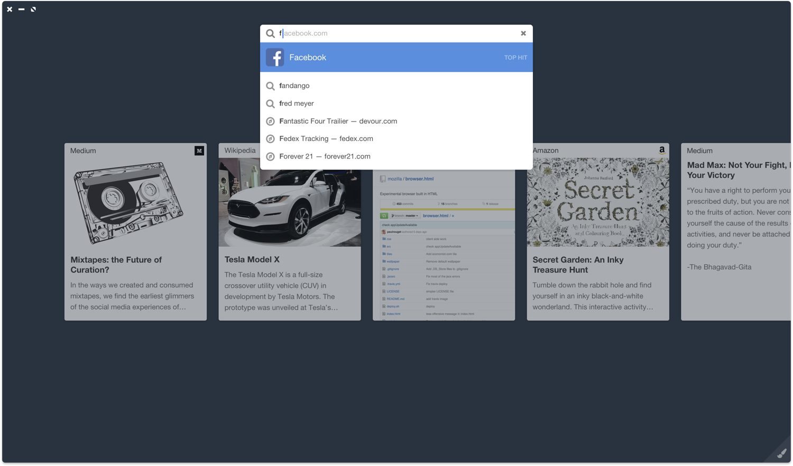

# Web Cards

### Problem

There is no discovery component to the browser, only task-oriented search.

It’s too hard for publishers to syndicate content to mobile. Facebook is using their leverage to supplant the web with Instant Articles.

### Hypothesis

- Follow sites you visit.
- Timeline shows you new cards from sites.
- Webcards API lets sites push stories to you.

### Cards

### Search

### Picture in Picture

### Wallpapers

<video src="./ElatedDistantDrever.mp4"></video>

