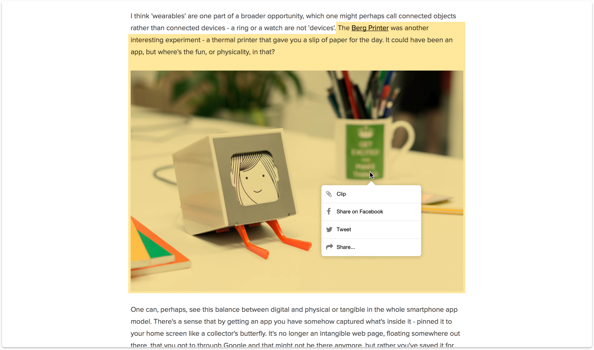

# Web Clips

Browsers is a medium for accessing world of information yet only tool to retain some is bookmarks, that is long list addresses that at a time hosted it.

Web clips was an experiment to create more adequate tool. It simply allows you to clip anything you liked straight out of a webpage.

- Cardify the web, building a heat map of what is most important
- Bring that valuable content to other platforms (my cards on my laptop, mobile, tablet, watch etc)
- Cards offer answers > web search

