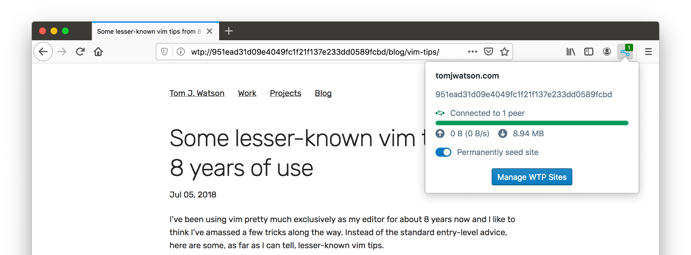

# WebTorrent concept browser

[@tom-james-watson][] implemented a concept distributed web browser powered by torrents. Instead of the traditional client/server architecture, websites are published and loaded via torrents. [wtp-ext][] web extension uses [libdweb][] to add protocol `wtp://` protocol support to the Firefox. _(Image below shows wtp site being loaded in Firefox)_ 

[@tom-james-watson]:https://github.com/tom-james-watson "Tom Watson"
[libdweb]:https://github.com/mozilla/libdweb "Experimental Firefox extension APIs for P2P"
[wtp-ext]:https://github.com/tom-james-watson/wtp-ext "Proof-of-concept distributed web powered by WebTorrents"